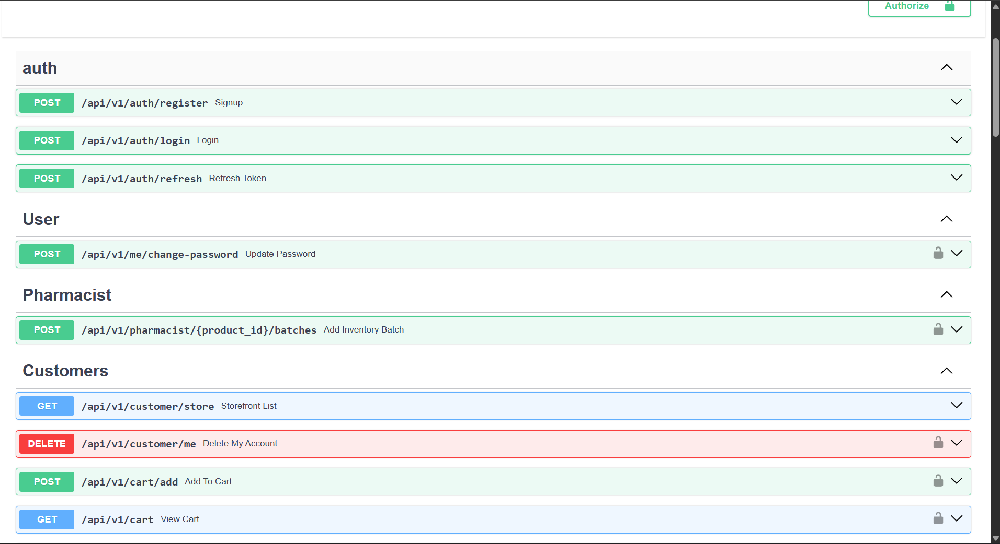
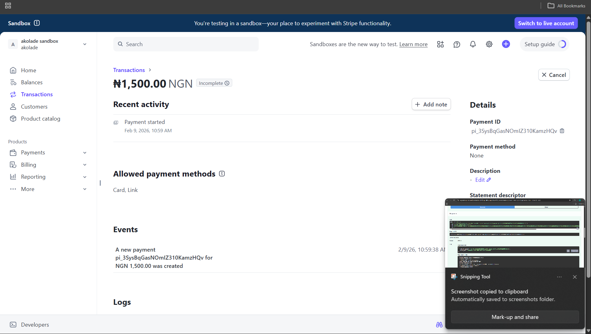
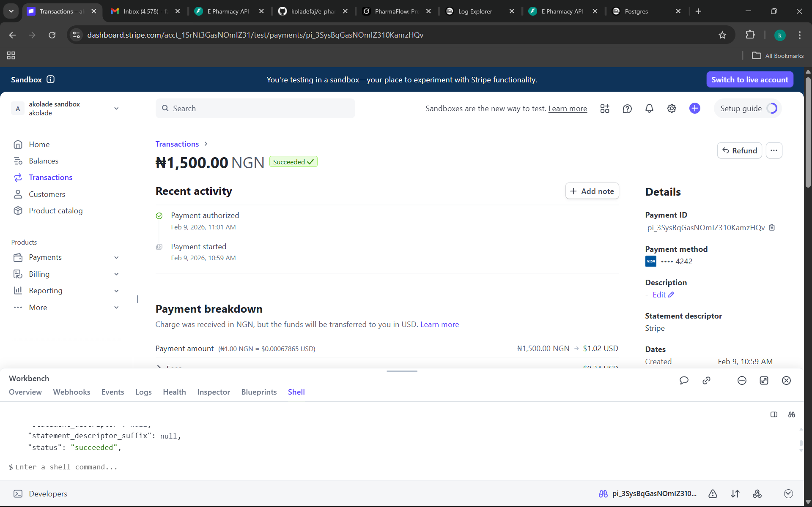
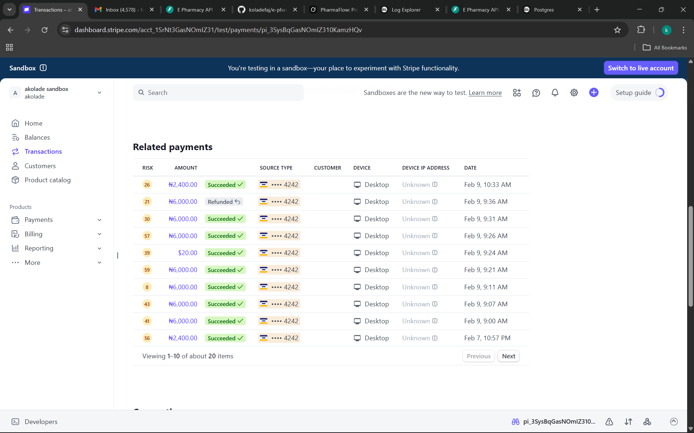
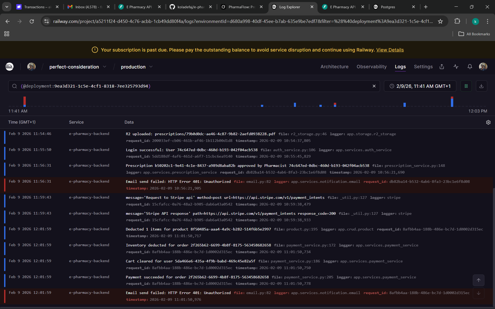

# PharmaFlow – Production-Grade E-Pharmacy Backend

**A secure, regulated, asynchronous FastAPI backend for pharmaceutical e-commerce**

Featuring prescription verification workflows, role-based access control (User / Pharmacist / Admin), reliable & idempotent Stripe payments, Redis-powered carts with background sync, and production-ready DevOps.

[](https://github.com/koladefaj/e-pharmacy-backend)

[](https://e-pharmacy-backend-production-d44b.up.railway.app/docs)



*Role-based endpoints for Users, Pharmacists, and Admins*

> ⚠️ Live demo runs in Stripe sandbox mode. No real payments processed.


## ✨ Key Features

- **Regulated Prescription Checkout**  
  Prescription (RX) items require pharmacist approval **before** payment — enforces real pharmaceutical compliance & patient safety.

- **Redis-Powered Cart + Background Sync**  
  Ultra-fast in-memory cart during sessions → automatic async sync to PostgreSQL → persistent across logins with TTL expiration.

- **Secure Authentication & Granular RBAC**  
  - JWT with refresh token rotation  
  - Customer / Pharmacist / Admin roles with fine-grained permissions

- **Reliable & Idempotent Stripe Payments**  
  - Webhook-driven order state updates (single source of truth)  
  - **Idempotency keys** prevent duplicate charges on retries, network failures, or duplicate calls  
  - Prevents inconsistent states from client-side interruptions

- **Automated Inventory & Batch Management**  
  Batch-level tracking, expiry monitoring, automatic stock deduction on fulfillment

- **Security-First Design**  
  Rate limiting (login/registration), audit logging for admin actions, strict input validation

## 🛠 Tech Stack & Rationale

| Technology          | Role                        | Why Chosen                                                                 |
|---------------------|-----------------------------|----------------------------------------------------------------------------|
| **FastAPI**         | API Framework               | Async-first, type-safe, excellent for concurrent workloads (payments, DB) |
| **PostgreSQL**      | Primary Database            | ACID compliance critical for orders, inventory, financial data            |
| **Redis**           | Cart / Session Store        | Ultra-fast reads/writes for volatile cart data                            |
| **SQLAlchemy (Async)** | ORM                      | Pythonic + full async support                                             |
| **Stripe**          | Payments                    | Industry standard + strong webhook + idempotency support                  |
| **Docker & Compose**| Containerization            | Reproducible dev & prod environments                                      |
| **Pytest + Asyncio**| Testing                     | Validates async flows & state transitions                                 |
| **GitHub Actions**  | CI/CD                       | Automated lint, test, security & container scans                          |

## 🏗 Architecture Highlights & Trade-offs

### 1. Prescription State Machine

- Orders with RX items start in `AWAITING_PRESCRIPTION`
- Pharmacist approval required before payment → non-negotiable for compliance

**Trade-off**: UX friction vs. **regulatory & patient safety** necessity

### 2. Redis Cart → PostgreSQL Background Sync

- Active carts live in Redis for speed
- FastAPI background tasks sync changes asynchronously
- Cart restored on re-login, expires after TTL

**Trade-off**: Deferred persistence (volatile by design) vs. massive reduction in DB load

### 3. Idempotent Payment Flow

**Problem**: Retries / refreshes / network flakes → risk of duplicate `PaymentIntent`s & double charges

**Solution**:
- Deterministic idempotency key per order (`payment-order-{order_id}`)
- Reuse existing `payment_intent_id` when present
- Stripe guarantees exactly-once creation for the same key

**Result**: Safe retries, no duplicate charges, robust against client errors

### 4. Webhook Reliability

Order status updated **only** via `payment_intent.succeeded` webhook — **never** from client redirect

**Result**: No false "unpaid" orders from browser closes or interruptions

## 🔄 DevOps & Production Readiness

- **Docker + Docker Compose** — local & production environment parity
- **GitHub Actions CI/CD pipeline**:
  - Ruff / Black / isort linting
  - Pytest (sync + async tests)
  - Security scanning: Bandit, Safety, Hadolint, Trivy (container)
  - Gated image build & push (fails on vulnerabilities)

## 🛣 Selected API Endpoints

| Method | Endpoint                                    | Description                              |
|--------|---------------------------------------------|------------------------------------------|
| POST   | `/api/v1/prescriptions/upload`              | Secure document upload                   |
| POST   | `/api/v1/prescriptions/approve`             | Pharmacist approves → unlocks payment    |
| POST   | `/api/v1/pharmacist/register`               | Secure pharmacist onboarding             |
| PATCH  | `/api/v1/pharmacist/{id}/approve`           | Admin performs license verification      |

## 🚀 Quick Start

```bash
git clone https://github.com/koladefaj/e-pharmacy-backend.git
cd e-pharmacy-backend
```

# Copy and configure environment variables
```bash
cp .env.example .env
```
# ────────────────────────────────────────
# Edit .env file:
#   DATABASE_URL=...
#   REDIS_URL=...
#   STRIPE_SECRET_KEY=...
#   STRIPE_WEBHOOK_SECRET=...
#   JWT_SECRET_KEY=...
# ────────────────────────────────────────

# Start the stack
```bash
docker compose up --build
```

# Open Swagger UI
```bash
→ http://localhost:8000/docs
```

## 🧪 What This Project Demonstrates

A production-ready FastAPI backend that handles the unique challenges of pharmaceutical e-commerce with discipline and care.

### Core Technical Demonstrations

- **Advanced async patterns**  
  Background tasks, webhook processing, non-blocking flows

- **Regulated domain modeling**  
  Multi-stage prescription workflows, compliance gates, state transitions

- **Bullet-proof payment architecture**  
  Idempotent Stripe PaymentIntents + webhook-only state updates

- **Hybrid caching strategy** (Redis + PostgreSQL)  
  Speed-first cart experience with reliable background persistence  
  Clear explanation of trade-offs (volatility vs DB pressure)

### Production Engineering Practices

- Full **CI/CD pipeline** (GitHub Actions)
- Multi-layer **security scanning** (Bandit, Safety, Trivy, Hadolint)
- **Rate limiting** on auth & sensitive endpoints
- **Audit logging** for admin and pharmacist actions
- Strict **input validation** & sanitization everywhere

Built with a strong focus on **security**, **reliability**, and **regulatory compliance**

### Stripe Payment — Idempotent & Webhook-Driven




- Successful Stripe PaymentIntent in sandbox mode  
- Webhook (`payment_intent.succeeded`) is the single source of truth  
- Prevents duplicate charges via deterministic idempotency keys  
- Supports NGN payments with automatic FX settlement

### Payment History & Refund Handling



- Multiple successful transactions across test runs  
- Refunds handled correctly via Stripe dashboard  
- Confirms safe retries without duplicate charges

### Production Logs — End-to-End Order Lifecycle



Real production logs showing a full regulated checkout flow:

1. Prescription uploaded to object storage (R2)
2. Pharmacist approval event
3. Stripe PaymentIntent creation
4. Webhook confirmation (`payment_intent.succeeded`)
5. Inventory deduction (batch-aware)
6. Cart cleared after successful payment

This validates correct ordering, atomicity, and domain compliance.


© Kolade Fajimi • Backend Engineering • Secure & Reliable Systems  
2024–2025